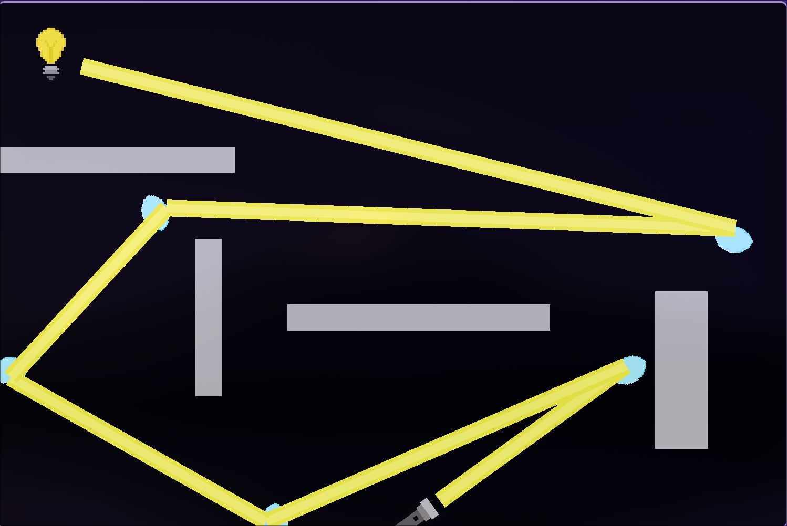

# Lumen
A game built in python that revolves around light!



# Description

This is a game created in `pygame-ce` that revolves around light. It uses ray casting to generate beam endpoints, and if an endpoint is out of the window, it automatically stops (also mostly uses `pygame.math.Vector2()` for positions).

You use your LEFT and RIGHT arrow keys to move the flashlight around. You can hover your mouse over a mirror and press A / D to rotate it.

This is a open source project, so you could commit, clone, change, or do whatever you want with it!

# Installation

1. Clone the repository
```bash
git clone https://github.com/JKG-cpu/Lumen.git
cd Lumen
```

2. Install dependencies
```bash
uv sync
```

3. Run the game!
```bash
uv run lumen
```

# Help

Please open an issue if you are experiencing and problems!
